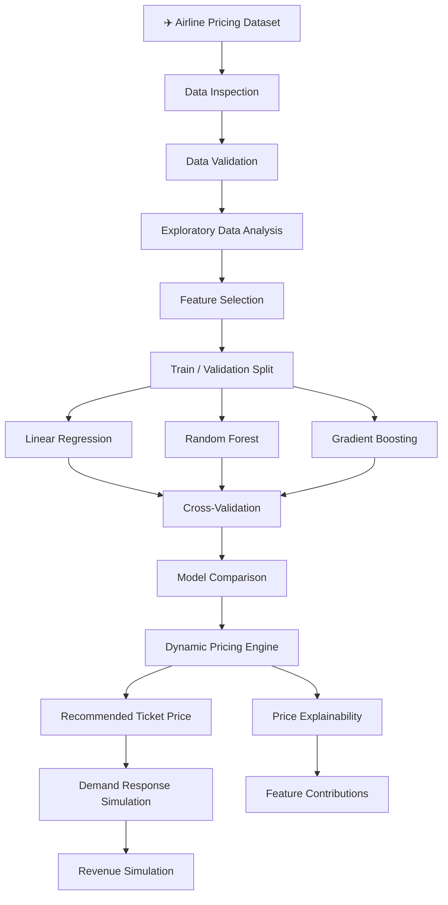
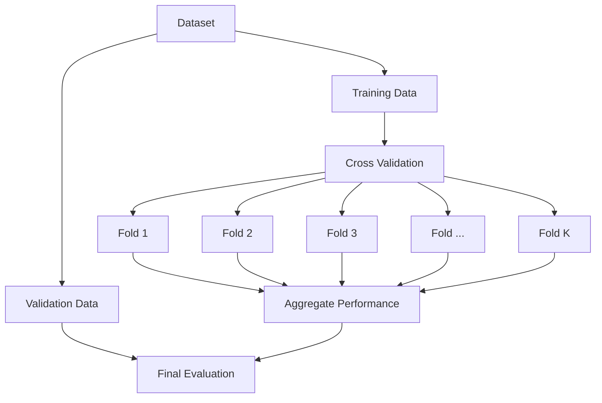
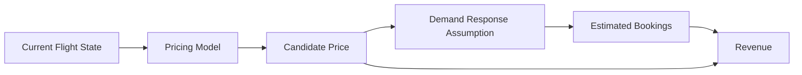
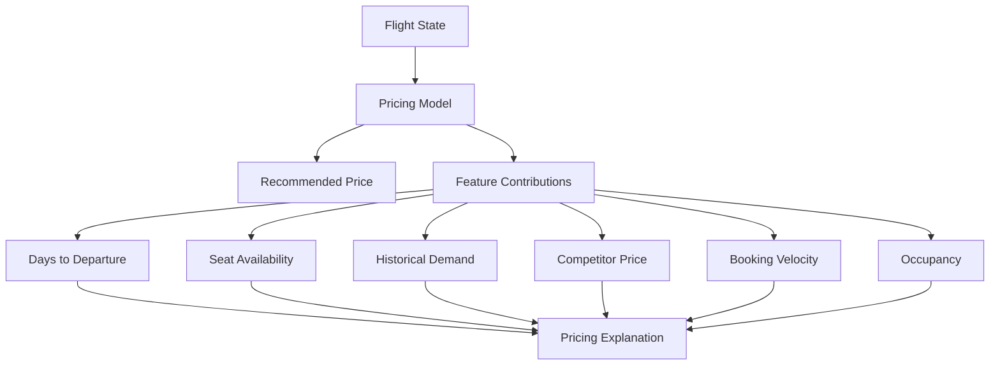

# ✈️ Flight Dynamic Pricing Model

<p align="center">

**A Data-Driven Machine Learning System for Airline Ticket Price Prediction and Dynamic Pricing Simulation**

</p>

<p align="center">


</p>

---

## 📌 Overview

Airline ticket prices are rarely static.

Prices can change depending on factors such as:

* ✈️ Days remaining before departure
* 💺 Remaining seat availability
* 📈 Historical demand
* 💰 Competitor pricing
* ⚡ Booking velocity
* 📅 Weekend/weekday behavior
* 🪑 Flight capacity
* 👥 Occupancy rate

This project develops a **machine-learning-based flight pricing framework** that learns the relationship between flight-state variables and ticket prices, then uses the predicted price within a dynamic pricing and revenue simulation workflow.

Rather than treating the project as only a regression problem, the system explores the complete decision pipeline:

> **Flight State → Price Prediction → Dynamic Pricing → Demand Response → Revenue Simulation → Price Explanation**

---

# 🎯 Project Objectives

The project investigates whether flight-state variables can be used to construct a predictive pricing model and evaluate potential dynamic pricing decisions.

### Core objectives

1. Validate and explore airline pricing data.
2. Identify important pricing-related variables.
3. Build a baseline ticket-price prediction model.
4. Compare linear and nonlinear regression models.
5. Evaluate model stability using cross-validation.
6. Investigate feature dependency using ablation analysis.
7. Generate dynamic ticket-price recommendations.
8. Simulate customer demand under different pricing scenarios.
9. Compare simulated revenue outcomes.
10. Explain individual pricing recommendations through feature contributions.

---

# 🧠 Problem Statement

Traditional airline pricing can rely on static or predetermined pricing rules.

However, the state of a flight changes continuously.

For example:

* A flight may have fewer seats available.
* Booking activity may accelerate.
* Historical demand may indicate stronger interest.
* A competitor may change its price.
* The departure date may become closer.

A dynamic pricing framework attempts to incorporate these changing conditions into pricing decisions.

### Research Question

> **Can flight-state variables be used to predict airline ticket prices and support dynamic pricing decisions under different demand-response scenarios?**

---

# 📊 Dataset

The project uses an airline pricing dataset containing **1,000 observations** and **10 variables**.

The dataset is stored as:

```text
Airlinedataset.csv
```

### Dataset Features

| Feature             | Description                               |
| ------------------- | ----------------------------------------- |
| `days_to_departure` | Number of days remaining before departure |
| `seats_remaining`   | Number of seats still available           |
| `historical_demand` | Historical demand indicator               |
| `competitor_price`  | Observed competitor ticket price          |
| `booking_velocity`  | Rate at which bookings are occurring      |
| `is_weekend`        | Indicates weekend travel                  |
| `flight_capacity`   | Total capacity of the flight              |
| `occupied_seats`    | Number of occupied seats                  |
| `occupancy_rate`    | Proportion of seats currently occupied    |
| `ticket_price`      | Target ticket price                       |

### Target Variable

```text
ticket_price
```

The machine-learning models attempt to learn the relationship between the flight-state features and the observed ticket price.

---

# 🏗️ System Architecture



---

# 🔬 Machine Learning Workflow

The project follows a structured data-science workflow rather than directly training a model on raw data.


---

# 📈 Exploratory Data Analysis

The exploratory analysis focuses on understanding how flight-state variables relate to ticket prices.

Key relationships investigated include:

### Days to Departure

The relationship between:

```text
days_to_departure ↔ ticket_price
```

This helps investigate whether prices change as the departure date approaches.

### Seat Availability

```text
seats_remaining ↔ ticket_price
```

This examines whether lower seat availability is associated with different pricing behavior.

### Demand

```text
historical_demand ↔ ticket_price
```

This investigates the relationship between historical demand and observed prices.

### Competitor Pricing

```text
competitor_price ↔ ticket_price
```

This examines how competitor prices relate to the target ticket price.

### Occupancy

```text
occupancy_rate ↔ ticket_price
```

Occupancy provides a direct representation of the current state of the flight.

---

# 🤖 Models

The project compares multiple regression approaches.

## 1. Linear Regression

Provides a simple baseline and measures linear relationships between the input variables and ticket price.

```text
Features → Linear Relationship → Predicted Price
```

Advantages:

* Simple
* Interpretable
* Useful baseline
* Easy to analyze feature coefficients

---

## 2. Random Forest

Random Forest captures nonlinear relationships and interactions between flight-state variables.

```text
Flight Features
       ↓
Multiple Decision Trees
       ↓
Aggregated Prediction
       ↓
Ticket Price
```

This allows the system to model relationships that may not be adequately represented by a linear model.

---

## 3. Gradient Boosting

Gradient Boosting builds an ensemble of sequential decision trees where later models focus on correcting previous errors.

```text
Initial Model
      ↓
Residual Errors
      ↓
Next Tree
      ↓
Residual Errors
      ↓
Additional Trees
      ↓
Final Prediction
```

This provides another nonlinear model for comparison.

---

# 🧪 Model Validation

Model evaluation is not based on a single train/test result.

The project includes **cross-validation** to examine model stability across different data splits.

The evaluation process can be represented as:



Typical regression metrics can include:

* MAE
* MSE
* RMSE
* R²

The notebook results should be treated as the source of truth for the final numerical model comparison.

---

# 🧩 Feature Ablation Analysis

An important component of this project is **ablation analysis**.

Instead of assuming every feature is necessary, groups of features can be removed and the model can be retrained.

### Concept

```text
Full Feature Set
       ↓
Train Model
       ↓
Evaluate
       ↓
Remove Feature / Feature Group
       ↓
Retrain
       ↓
Compare Performance
```

This helps investigate:

> **How dependent is pricing performance on individual flight-state variables?**

For example, the analysis can investigate the contribution of:

* Demand
* Competitor pricing
* Seat availability
* Booking velocity
* Time to departure
* Occupancy

---

# 💰 Dynamic Pricing Engine

After developing the predictive models, the project moves from **prediction** toward **pricing simulation**.

The pricing engine receives the current state of a flight:

```text
Days to Departure
Seats Remaining
Historical Demand
Competitor Price
Booking Velocity
Weekend Status
Flight Capacity
Occupied Seats
Occupancy Rate
```

and produces:

```text
Recommended Ticket Price
```

Conceptually:

```text
Current Flight State
        ↓
Trained Pricing Model
        ↓
Predicted Price
        ↓
Pricing Decision
```

---

# 📊 Demand-Response Simulation

A predicted price alone does not tell us how much revenue a flight may generate.

Therefore, the project introduces demand-response simulation.

The simulation asks:

> **How might customer demand change when the recommended price changes?**

Conceptually:



This allows different pricing scenarios to be evaluated rather than treating the model's predicted price as automatically optimal.

---

# 💵 Revenue Simulation

A basic revenue relationship can be represented as:

```text
Revenue = Ticket Price × Number of Tickets Sold
```

The simulation evaluates how changes in:

* Ticket price
* Estimated demand
* Number of bookings

can affect simulated revenue.

### Example Concept

```text
Lower Price
    ↓
Potentially Higher Demand
    ↓
More Tickets Sold
    ↓
Revenue

Higher Price
    ↓
Potentially Lower Demand
    ↓
Fewer Tickets Sold
    ↓
Revenue
```

The purpose is to study the trade-off between **price per ticket** and **quantity sold**.

---

# 🔍 Price Explainability

A dynamic pricing system should not only provide a number.

It should also help answer:

> **Why was this price recommended?**

The project therefore includes price explainability through feature contributions.

Conceptually:



This makes the system more interpretable for analysis and decision support.

---

# 🧪 Experimental Components

The project contains several analytical components beyond basic model training.

| Component                 | Purpose                                 |
| ------------------------- | --------------------------------------- |
| Exploratory Data Analysis | Understand pricing patterns             |
| Baseline Regression       | Establish a simple reference model      |
| Model Comparison          | Compare linear and nonlinear approaches |
| Cross-Validation          | Evaluate model stability                |
| Ablation Analysis         | Investigate feature dependency          |
| Dynamic Pricing           | Generate candidate prices               |
| Demand Simulation         | Model potential response to price       |
| Revenue Simulation        | Evaluate pricing scenarios              |
| Explainability            | Understand pricing recommendations      |

---

# 📁 Project Structure

```text
Flight-Dynamic-Pricing-Model/
│
├── Airlinedataset.csv
│
├── notebooks/
│   ├── ...
│   └── ...
│
└── README.md
```

The `notebooks/` directory contains the analytical and modeling workflow.

---

# 🛠️ Tech Stack

| Technology       | Purpose                         |
| ---------------- | ------------------------------- |
| Python           | Core programming language       |
| Pandas           | Data manipulation               |
| NumPy            | Numerical computation           |
| Matplotlib       | Visualization                   |
| Seaborn          | Statistical visualization       |
| Scikit-learn     | Machine learning and validation |
| Jupyter Notebook | Analysis and experimentation    |
| Git & GitHub     | Version control                 |

---

# ⚙️ Installation

## 1. Clone the repository

```bash
git clone <repository-url>
cd Flight-Dynamic-Pricing-Model
```

## 2. Create a virtual environment

### Windows PowerShell

```powershell
python -m venv .venv
```

Activate it:

```powershell
.venv\Scripts\Activate.ps1
```

### Windows Command Prompt

```cmd
.venv\Scripts\activate
```

---

# 📦 Install Dependencies

If a `requirements.txt` file is present:

```bash
pip install -r requirements.txt
```

Otherwise, the main analytical dependencies can be installed with:

```bash
pip install pandas numpy matplotlib seaborn scikit-learn jupyter
```

---

# ▶️ Run the Project

Start Jupyter Notebook:

```bash
jupyter notebook
```

Then open the relevant notebook from:

```text
notebooks/
```

Run the notebook cells sequentially to reproduce the analysis.

---

# 📊 Reproducible Workflow

The intended workflow is:

```text
1. Load Dataset
       ↓
2. Validate Data
       ↓
3. Explore Variables
       ↓
4. Prepare Features
       ↓
5. Train Models
       ↓
6. Cross-Validate
       ↓
7. Compare Models
       ↓
8. Perform Ablation Analysis
       ↓
9. Generate Dynamic Prices
       ↓
10. Simulate Demand
       ↓
11. Simulate Revenue
       ↓
12. Explain Recommendations
```

---

# ⚠️ Important Modeling Considerations

Dynamic pricing is more complicated than simply predicting a ticket price.

A predictive model estimates relationships found in historical data, but a pricing system ultimately involves a **decision under uncertainty**.

Therefore:

* Predicted price ≠ guaranteed optimal price.
* Simulated demand depends on the assumed demand-response relationship.
* Simulated revenue depends on the simulation assumptions.
* Historical relationships do not automatically establish causal effects.
* Competitor price and demand may be correlated with other market conditions.
* Real airline pricing systems would require much richer data and operational constraints.

The revenue simulation should therefore be interpreted as a **scenario-analysis framework**, not as a production airline revenue optimizer.

---

# 🚀 Future Improvements

The project can be extended into a more production-oriented revenue-management system.

### 📌 Advanced Demand Forecasting

Add:

* Time-series forecasting
* Seasonal demand
* Route-level demand
* Holiday effects
* Historical booking curves

### 📌 Price Elasticity

Estimate how demand changes as price changes.

```text
Price Change
     ↓
Demand Change
     ↓
Revenue Change
```

### 📌 Competitor Intelligence

Integrate:

* Competitor fares
* Route-level competition
* Fare-class information
* Market-level pricing

### 📌 Optimization

Instead of predicting one price, optimize:

```text
Expected Revenue
        ↓
Subject to
        ↓
Minimum Price
Maximum Price
Capacity
Demand
Operational Constraints
```

### 📌 Real-Time API

The pricing model could eventually be exposed through:

```text
FastAPI
   ↓
Pricing Endpoint
   ↓
Flight State
   ↓
Recommended Price
```

### 📌 Interactive Dashboard

A future dashboard could allow users to modify:

* Days to departure
* Seats remaining
* Demand
* Competitor price
* Booking velocity
* Occupancy

and observe how the simulated price and revenue change.

---

# 📚 Key Concepts Demonstrated

This project demonstrates practical understanding of:

* Regression
* Supervised machine learning
* Feature selection
* Model comparison
* Cross-validation
* Ablation analysis
* Dynamic pricing
* Demand modeling
* Revenue simulation
* Explainable machine learning
* Scenario analysis
* Decision-oriented data science

---

# 🎯 Project Takeaway

This project goes beyond simply asking:

> **"What will the ticket price be?"**

It explores a broader data-science problem:

> **"Given the current state of a flight, how can a predictive model support pricing decisions, and how can those decisions be evaluated under different demand and revenue scenarios?"**

The resulting workflow connects **machine learning, pricing analytics, simulation, and explainability** into a single airline revenue-management research framework.

---

## 👨‍💻 Author

**Deban Kumar Das D**

BCA — Data Science

GitHub: `Debankumardas`

---

## ⭐ Project Focus

```text
Airline Data
     ↓
Machine Learning
     ↓
Price Prediction
     ↓
Dynamic Pricing
     ↓
Demand Simulation
     ↓
Revenue Analysis
     ↓
Explainable Decisions
```

**Built as a practical Data Science project exploring machine-learning-assisted airline pricing.**
